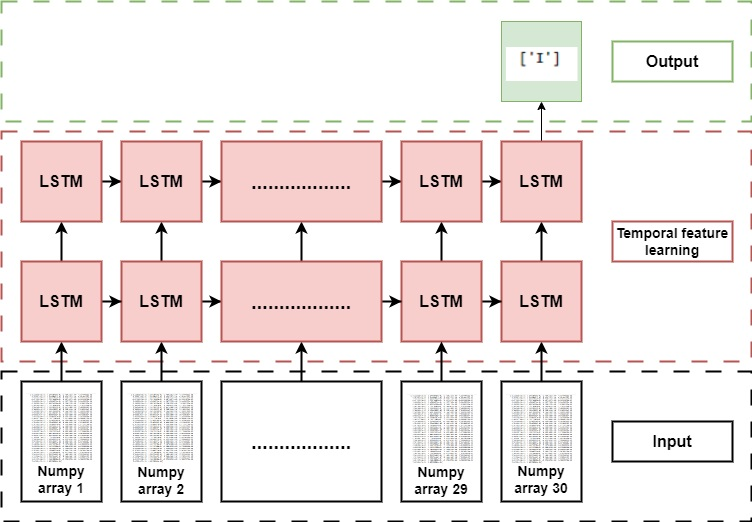

# Sign-Language-Detection-using-Skeletal-Points

## Abstract
Sign language is a visual language that serves as the primary means of communication in the non-hearing community. To facilitate daily communication between the non-hearing and the hearing communities, it is important to develop sign language translation techniques. The
non-hearing community faces several challenges that hinder their interaction with the general public, such as the lack of knowledge of sign language and the availability of interpreters. A Sign Language Converter would thus be an important tool in breaking the communication barrier between the non-hearing and hearing communities. The aim of the project is to build a model that converts Indian Sign Language into corresponding words. We used a skeletal-point feature extraction framework to identify hand landmarks from sequences containing distinct signs and use these landmarks to build a model for recognizing hand gestures using various Long Short-Term Memory (LSTM) Networks. This approach can produce an accurate result compared to the traditional approach. 

## Architecture

The proposed system detects sequences of skeletal coordinate points detected using MediaPipe, Google's open-source framework. The coordinate points of the right and left hands will be taken and will be trained on an LSTM network to obtain a model.  
\

### 1. Data Collection and Preprocessing

- **Extract key points :**  The data points from hand are extracted using the help of a computer vision toolkit.  The skeleton points from both left and right hands are stored in file storage for further processing. These key points are manipulated using n-dimension arrays

- **Designing RNN Architecture :** An LSTM model is built using TensorFlow and Keras to predict the action based on the key points. The deep neural network is trained using LSTM layers to predict considering the temporal component, i.e., the action is predicted from multiple frames instead of a single frame. The model is trained to make real-time predictions using video sequences.

### 2. Detect Hands Landmarks

The video sequence (multiple frames) is captured using the webcam accessed using OpenCV. A secondary layer is applied to make detections using MediaPipe. For detection, the images should be in the format of RGB. Hence, the image frames captured are converted from BGR to RGB. After making left-hand and right-hand landmark identification, they are converted back to BGR.

The landmarks, returned from the hand estimation detection, are represented as x,y, and z coordinates. For each frame,  there are 21 hand landmarks each. The hand landmark model will return no values if nothing is detected. To see the landmarks, they are drawn onto the frames making connection maps.

### 3. Training LSTM Neural Network
 A sequential neural network is built using TensorFlow with fully-connected LSTM layers that give the temporal component to perform action detection. The TensorBoard logs are used to monitor the neural network.

 

  The proposed neural network is appended with the LSTM layers consisting of 64 LSTM units and the ReLU activation function. The input to this layer is the NumPy arrays of extracted keypoints dataset. The next two layers have 128 and 64 LSTM units respectively. This is followed by two fully-connected layers with 64 and 32 neural network neurons and ReLU\cite{relu} activation function. The final fully-connected layer uses a softmax activation function to obtain the output as probability values in the range of 0 to 1. Mediapipe combined with LSTM models requires only fewer data and it is faster to train and test the data and hence, gives faster detections.